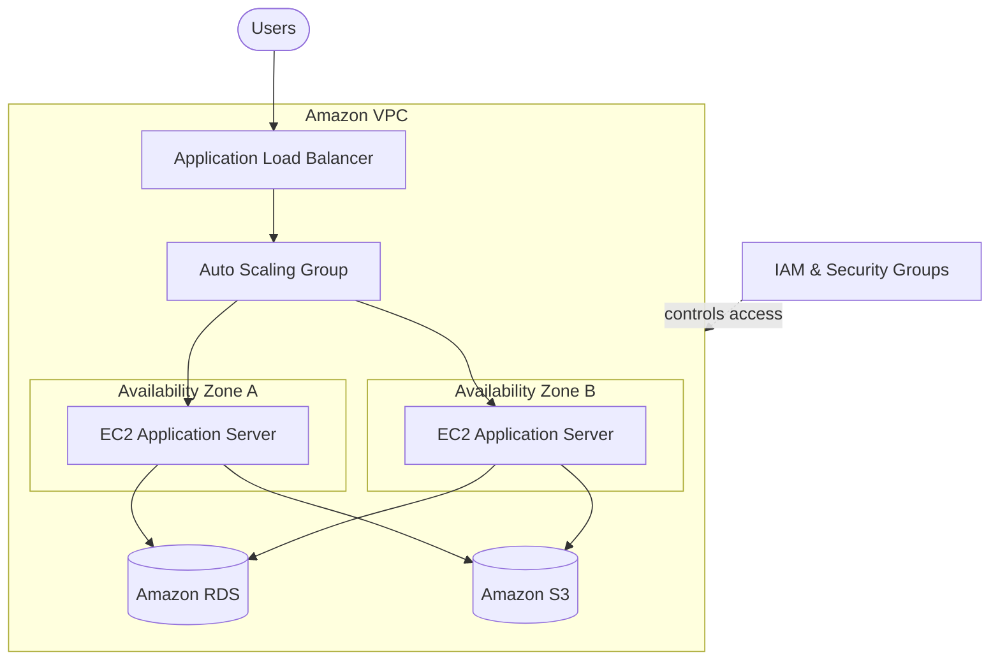
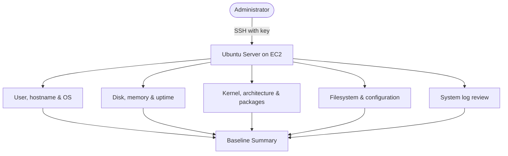

# Charles Chukwunonso

### AWS Cloud & Solutions Architecture Portfolio

I design and build secure, reliable, and cost-aware systems on AWS.

## About me

I design and deploy AWS solutions with a focus on security, reliability, performance, and cost. My work covers cloud architecture, networking, Linux administration, and infrastructure operations.

This portfolio shows the projects I've built, the AWS services I've used, and the decisions behind each solution.

## AWS projects

### 1. [Highly Available AWS Web Architecture](https://github.com/Agu-nwa/-aws-ha-arch)

I designed a web architecture that runs across two Availability Zones so it can handle failures and changes in traffic.

- **AWS services:** VPC, EC2, Application Load Balancer, Auto Scaling, RDS, S3, and IAM
- **What I worked on:** availability, scaling, network separation, and access control

### 2. [AWS EC2 + Nginx Web Server](https://github.com/Agu-nwa/AWS-Personal-Project)

I launched an Ubuntu EC2 instance, connected to it through SSH, installed Nginx, and used it to host a web page.

- **AWS services:** EC2 and Security Groups
- **What I worked on:** instance setup, SSH access, HTTP rules, and basic Linux server management

### 3. [Server Discovery & Baseline Assessment](https://github.com/Agu-nwa/Server-Discovery-and-Baseline-Assessment)

I documented how to check the condition of an Ubuntu server before making changes to it.

- **Skills used:** SSH, Linux commands, storage and memory checks, packages, processes, and logs
- **Outcome:** a clear server baseline that shows the system's current state before changes are made

## Skills and tools

| Area | What I've worked with |
|---|---|
| Compute | EC2, Auto Scaling, Linux, Nginx |
| Networking | VPC, subnets, routing, Security Groups, load balancing |
| Storage and databases | S3, RDS, EBS concepts |
| Security | IAM, least privilege, network separation, SSH access |
| Reliability | Multi-AZ design, health checks, fault isolation, scaling |
| Operations | Server checks, logs, monitoring basics, documentation |

## How I work on a project

1. Start with the requirements and understand what the system needs to do.
2. Look for possible points of failure and plan around them.
3. Think about security at every layer, from IAM to the network and data.
4. Write down the choices I make and why I made them.
5. Review the project and note what I can improve next time.

## Current focus

- Building more projects across the AWS SAA architecture domains
- Using Infrastructure as Code to make deployments repeatable
- Adding monitoring, backups, recovery plans, and cost estimates to my projects
- Improving my project documentation and architecture diagrams

## Let's connect

I'm open to cloud engineering opportunities, AWS projects, and conversations with other people working in cloud.

[View all my GitHub projects](https://github.com/Agu-nwa?tab=repositories)
