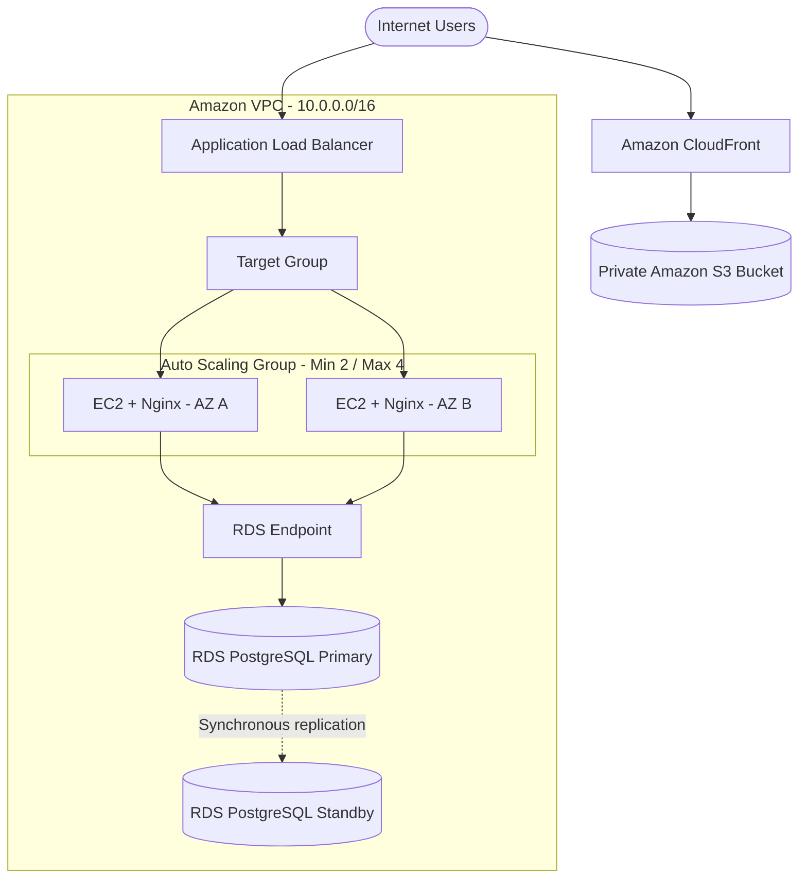
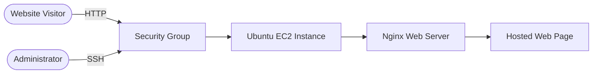

# Charles Chukwunonso

### AWS Cloud Engineer · Solutions Architecture · Linux

I design and build secure, reliable, and cost-aware systems on AWS.

## About

I design and deploy AWS solutions with a focus on security, reliability, performance, and cost. My work covers cloud architecture, networking, Linux administration, and infrastructure operations.

This portfolio shows what I've built, the services I've used, and the decisions behind each solution.

## Featured projects

### [Highly Available AWS Web Architecture](https://github.com/Agu-nwa/-aws-ha-arch)

A highly available web architecture running across two Availability Zones, with elastic compute, managed PostgreSQL, and separate delivery paths for application and static traffic.

**Stack:** VPC · EC2 · ALB · Auto Scaling · RDS PostgreSQL · S3 · CloudFront · IAM 
**Implemented:** Multi-AZ compute, health-based traffic distribution, EC2 replacement testing, RDS standby replication, and private S3 delivery through CloudFront 
**Documentation:** [Architecture and traffic flow](https://github.com/Agu-nwa/-aws-ha-arch/blob/main/architecture/architecture.md) · [Design decisions](https://github.com/Agu-nwa/-aws-ha-arch/blob/main/architecture/decisions.md)

<strong>View architecture diagram</strong>

---

### [EC2 + Nginx Web Server](https://github.com/Agu-nwa/AWS-Personal-Project)

An Ubuntu web server deployed on Amazon EC2 and configured to serve a web page with Nginx.

**Stack:** EC2 · Security Groups · Ubuntu · Nginx · SSH 
**Implemented:** Instance provisioning, key-based remote access, HTTP access rules, Nginx installation, and web content deployment

<strong>View deployment flow</strong>

---

### [Server Discovery & Baseline Assessment](https://github.com/Agu-nwa/Server-Discovery-and-Baseline-Assessment)

A documented assessment of an Ubuntu EC2 server used to understand its current state before configuration, migration, or hardening work.

**Stack:** EC2 · Ubuntu · SSH · Linux administration 
**Assessed:** Identity, operating system, kernel, storage, memory, uptime, packages, filesystem, configuration, and logs

<strong>View assessment flow</strong>

## Technical skills

| Area | Services and tools |
|---|---|
| Cloud architecture | AWS Well-Architected principles, high availability, scalability, fault isolation |
| Compute | Amazon EC2, Auto Scaling, Linux, Nginx |
| Networking | Amazon VPC, subnets, routing, Security Groups, Application Load Balancer |
| Storage and data | Amazon S3, Amazon RDS, Amazon EBS |
| Security | IAM, least privilege, network separation, key-based SSH access |
| Operations | Health checks, server baselining, logs, monitoring fundamentals |

## Current work

- Building AWS architectures across the Solutions Architect Associate domains
- Turning architecture designs into repeatable Infrastructure as Code
- Adding monitoring, backup, recovery, and cost estimates to existing projects
- Improving technical documentation and architecture decision records

## Contact

I'm open to cloud engineering opportunities, AWS projects, and conversations with other people working in cloud.

[Portfolio website](https://agu-nwa.github.io/Agu-nwa/) · [GitHub projects](https://github.com/Agu-nwa?tab=repositories)
